<center>***Aitor Domingo Machado Velázquez***</center> -
<center>***Kilian Manuel González Martín - 2º ASIR***</center> 

<center></center>

#NFS (Network File System)

NFS es una forma de crear recursos en red para compartir con sistemas heterogéneos.

#1. SO Windows
Para esta parte vamos a necesitar 2 máquinas:
* MV Windows 2008 Server (Enterprise) como nuestro servidor NFS.
    * Como nombre de esta máquina usar "primer-apellido-alumno+XX+WS".
    * IP estática 172.18.XX.22
    * Grupo de trabajo AULA108
    
    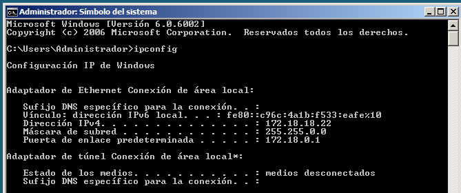
    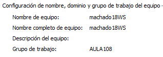
* MV Windows (Enterprise) como nuestro cliente NFS.
    * Como nombre de esta máquina usar "primer-apellido-alumno+XX+WC".
    * IP estática 172.18.XX.12
    * Grupo de trabajo AULA108
    
    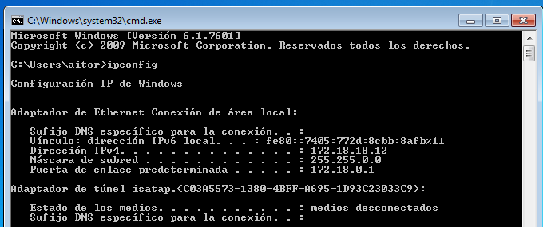 
    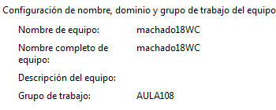
> Donde XX es el número de PC de la máquina real de cada uno. 
Para averiguar XX ejecuten en la máquina real, `ip a` o `ifconfig` o `if a s`, 
si muestra IP 172.16.8.30 entonces XX=30.

##1.1 Servidor NFS Windows

Instalación del servicio NFS en Windows 2008 Server
* Agregar rol `Servidor de Archivos`.
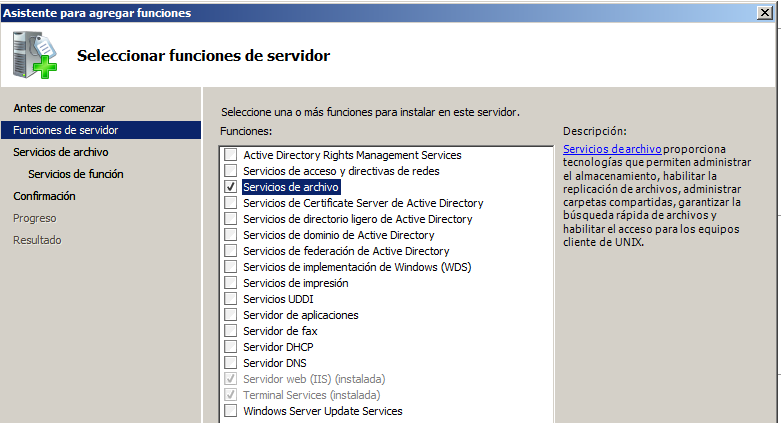
* Marcar `Servicio para NFS`.
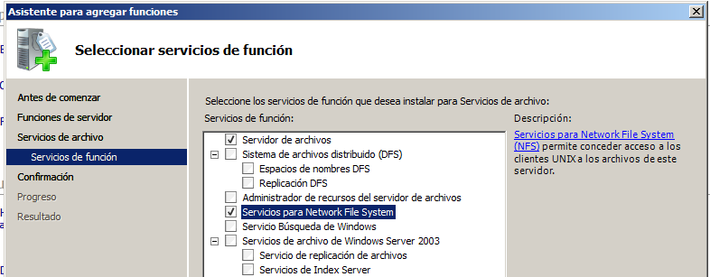
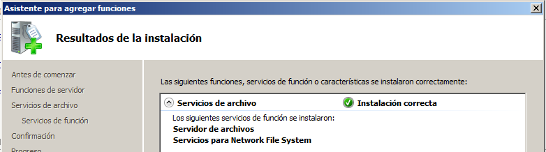

Configurar el servidor NFS de la siguiente forma:
* Crear la carpeta `c:\export\public`. Picar en la carpeta `botón derecho 
propiedades -> Compartir NFS`, y configurarla para que sea accesible desde 
la red en modo lectura/escritura con NFS

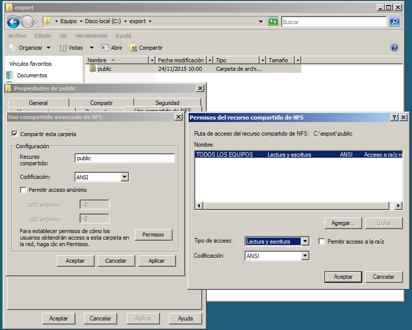
* Crear la carpeta `c:\export\private`. Picar en la carpeta `botón derecho 
propiedades -> Compartir NFS`, y configurarla para que sea accesible desde la red 
sólo en modo sólo lectura.

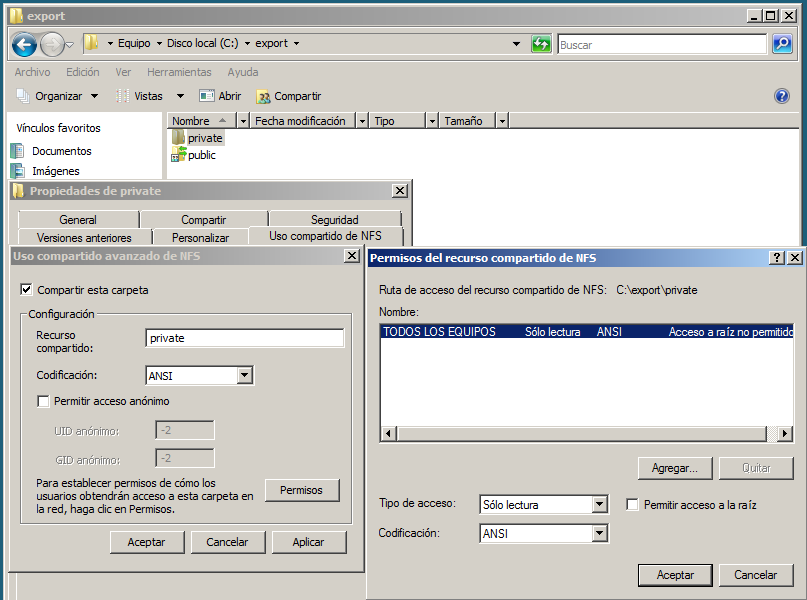

* Ejecutamos el comando `showmount -e ip-del-servidor`, para comprobar los recursos compartidos.
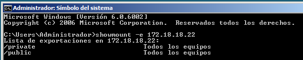

##1.2 Cliente NFS

Las últimas versiones de Windows permiten trabajar con directorios de red NFS nativos de sistemas UNIX. 
En esta sección veremos como montar y desmontar estos directorios bajo un entorno de Windows 7 
Enterprise (Las versiones home y starter no tienen soporte para NFS).

**Instalar el soporte cliente NFS bajo Windows**
* En primer lugar vamos a instalar el componente cliente NFS para Windows. 
Para ello vamos a `Panel de Control -> Programas -> Activar o desactivar características de Windows`.

Captura imagen del resultado final.
* Nos desplazamos por el menú hasta localizar Servicios para NFS y dentro de este, Cliente NFS. 
* Marcamos ambos y le damos a Aceptar.
* En unos instantes tendremos el soporte habilitado.

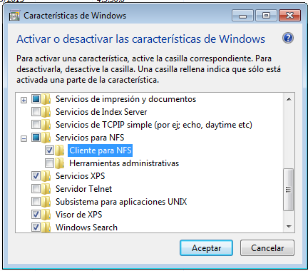

Iniciar el servicio cliente NFS. Captura imagen del proceso.
* Para iniciar el servicio NFS en el cliente, abrimos una consola con permisos de Administrador.
* Ejecutamos el siguiente comando: `nfsadmin client start`
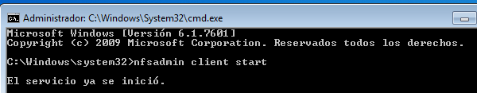

**Montando el recurso**

Ahora necesitamos montar el recurso remoto para poder trabajar con él.
* Esto no lo hacemos con Administrador, sino con nuestro usuario normal.
* Consultar desde el cliente los recursos que ofrece el servidor: `showmount -e ip-del-servidor`
* Montar recurso remoto: `mount –o anon,nolock,r,casesensitive \\ip-del-servidor\Nombre-recurso-NFS *`

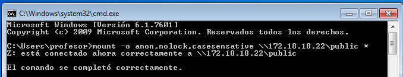
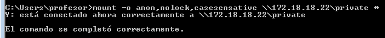

* Comprobar en el cliente los recursos montados: `net use`
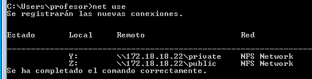


* Comprobar desde el cliente: `showmount -a ip-del-servidor`

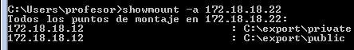

* En el servidor ejecutamos el comando `showmount -e ip-del-servidor`, para comprobar los recursos compartidos.
  
  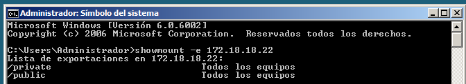
  
> **EXPLICACIÓN DE LOS PARÁMETROS**
>
> * anon: Acceso anónimo al directorio de red.
> * nolock: Deshabilita el bloqueo. Esta opción puede mejorar el rendimiento si sólo necesita leer archivos.
> * r: Sólo lectura. Para montar en modo lectura/escritura no usaremos este parámetro.
> * casesensitive: Fuerza la búsqueda de archivos con distinción de mayúsculas y minúsculas (similar a los clientes de NFS basados en UNIX).

* Hemos decidido asignar la letra de unidad de forma automática, así que si no hay otras unidades de red 
en el sistema nos asignará la Z.

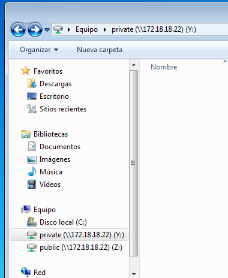

> Si hay problemas, comprobar que la configuración del cortafuegos del servidor permite accesos NFS.
>
> * Desde un cliente GNU/Linux hacemos `nmap IP-del-servidor -Pn`.
> * Debe aparecer abierto el puerto del servicio NFS

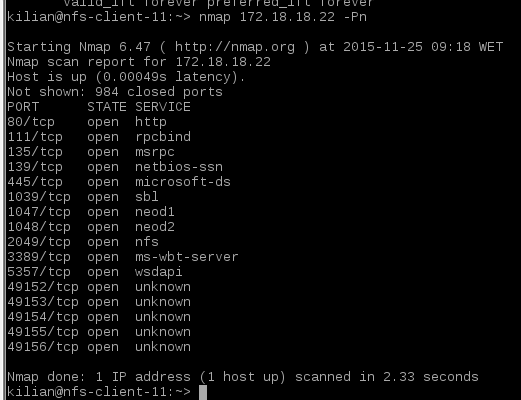

* Para desmontar la unidad simplemente escribimos en una consola: `umount z:`

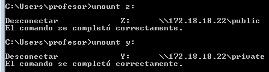

* En el servidor ejecutamos el comando `showmount -e ip-del-servidor`, para comprobar los recursos compartidos.

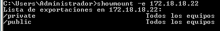
#2. SO OpenSUSE

Vamos a necesitar 2 máquinas GNU/Linux:

* MV OpenSUSE, donde instalamos el servicio NFS (directorios compartidos por red)
    * Como nombre de esta máquina usar `nfs-server-XX`. Modificar el fichero /etc/hostname, 
    para establecer el nombre de máquina, y el fichero /etc/hosts.
    * IP estática 172.18.XX.52
    * VirtualBox Red en Modo Puente
    
    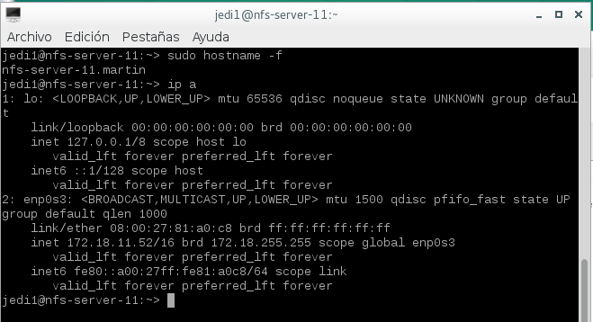
* MV OpenSUSE, donde instalaremos el cliente NFS.
    * Como nombre de esta máquina usar `nfs-client-XX`
    * IP estática 172.18.XX.62
    * VirtualBox Red en Modo Puente
    
    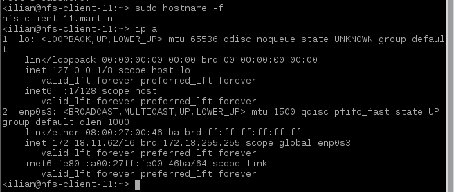

> * /ETC/HOSTS: Por comodidad podemos configurar el fichero /etc/hosts del cliente y servidor, 
añadiendo estas líneas:
> ```
> 172.18.XX.52 nfs-server-XX.apellido-alumno   nfs-server-XX
> ```
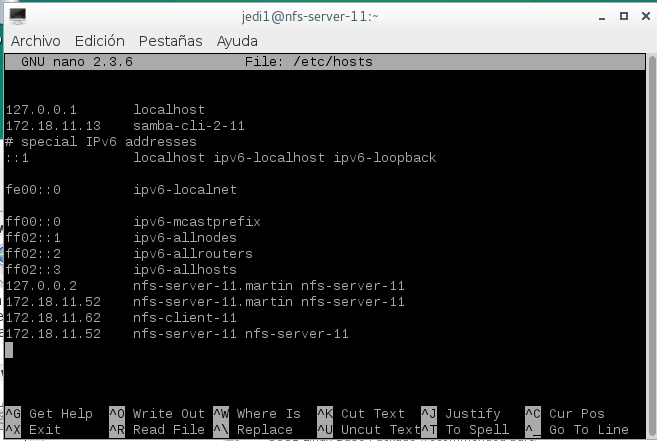
> ```
> 172.18.XX.62 nfs-client-XX.apellido-alumno   nfs-client-XX
> ```
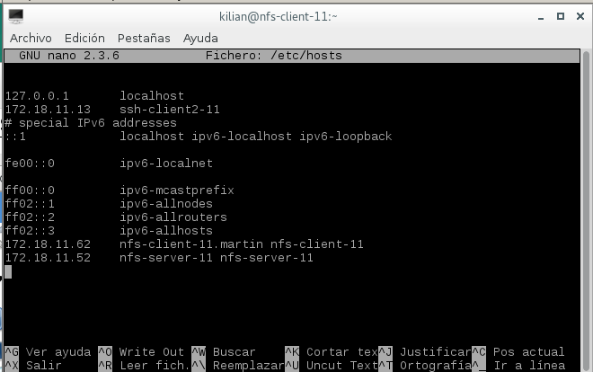
>
>* La configuración de los interfaces de red, servidores de nombres, etc. la podemos hacer en YAST.

##2.1 Servidor NFS


* Instalar servidor NFS por Yast.
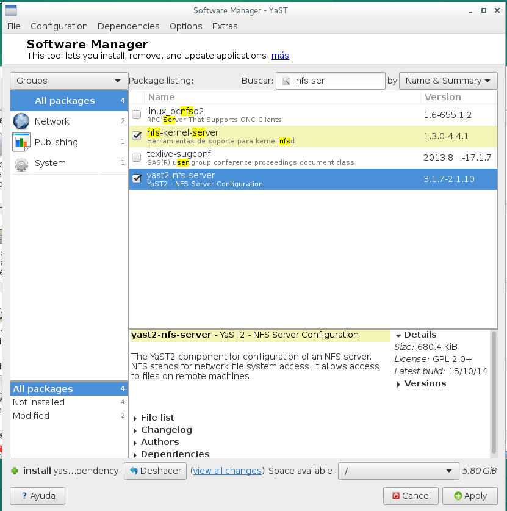
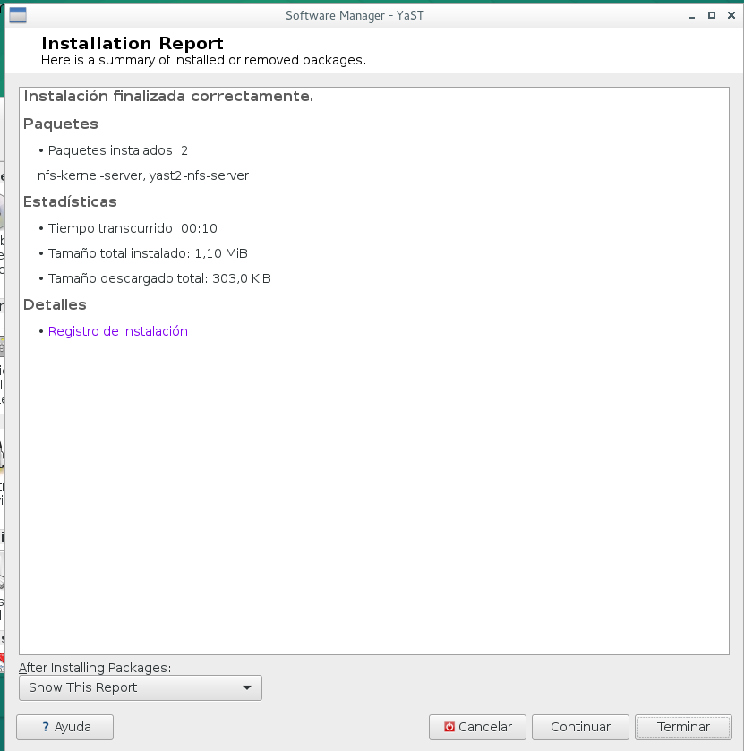
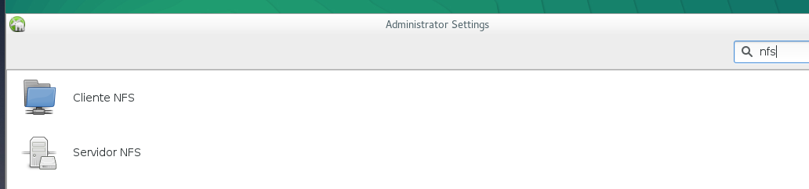
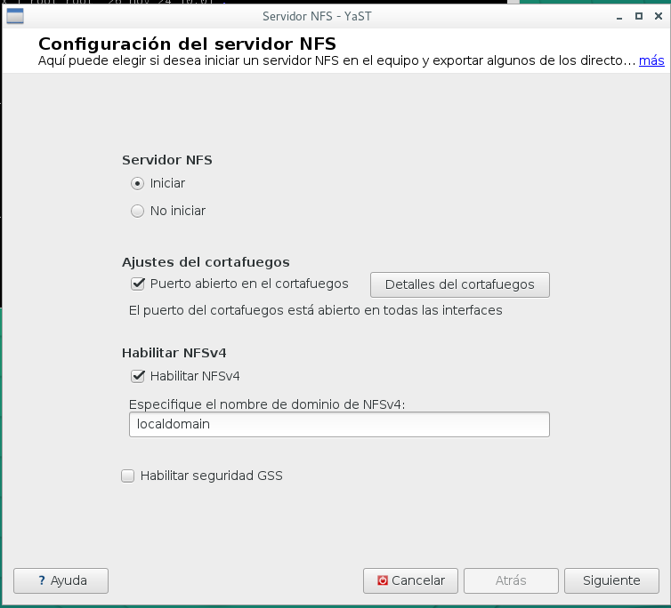

* Crear las siguientes carpetas/permisos:
    * `/var/export/public`, usuario y grupo propietario `nobody:nogroup`
    * `/var/export/private`, usuario y grupo propietario `nobody:nogroup`, permisos 770
    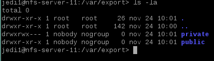
* Vamos configurar el servidor NFS de la siguiente forma:
    * La carpeta `/var/export/public`, será accesible desde toda la red en modo lectura/escritura.
    * La carpeta `/var/export/private`, sea accesible sólo desde la IP del cliente, sólo en modo lectura.
* Para ello usaremos o Yast o modificamos el fichero `/etc/exports` añadiendo las siguientes líneas:
```
    ...
    /var/export/public *(rw,sync,subtree_check)
    /var/export/private ip-del-cliente/32(ro,sync,subtree_check)
    ...
```
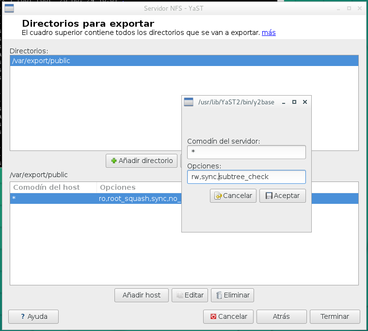
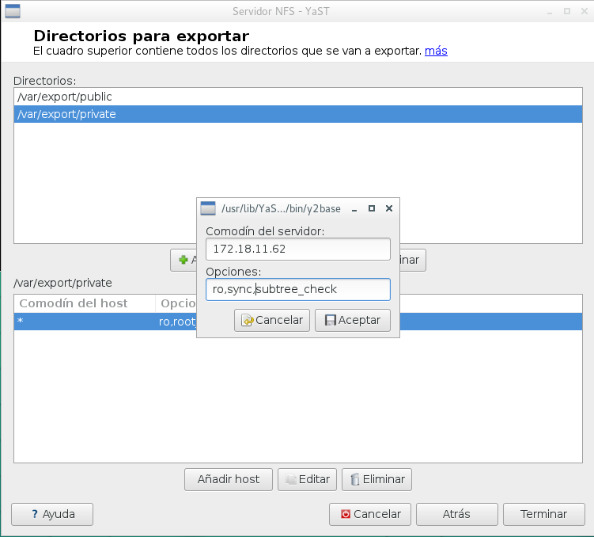
> OJO: NO debe haber espacios entre la IP y abrir paréntesis.

* Para iniciar y parar el servicio NFS, usaremos Yast o `systemctl`. Si al iniciar 
el servicio aparecen mensaje de error o advertencias, debemos resolverlas. 
Consultar los mensajes de error del servicio.

> [Enlace de interés](http://www.unixmen.com/setup-nfs-server-on-opensuse-42-1/)

* Para comprobarlo, `showmount -e localhost`. Muestra la lista de recursos exportados por el servidor NFS.    

    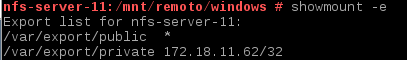

##2.2 Cliente NFS
En esta parte, vamos a comprobar que las carpetas del servidor son accesibles desde el cliente. 
Normalmente el software cliente NFS ya viene preinstalado pero si tuviéramos que instalarlo en 
OpenSUSE `zypper in nfs-common`.

Comprobar conectividad desde cliente al servidor:
* `ping ip-del-servidor`: Comprobar la conectividad del cliente con el servidor. Si falla hay que revisar las configuraciones de red.

    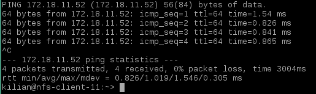
* `nmap ip-del-servidor -Pn`: nmap sirve para escanear equipos remotos, y averiguar que servicios están ofreciendo al exterior. Hay que instalar el paquete nmap, porque normalemente no viene preinstalado.

    
* `showmount -e ip-del-servidor`: Muestra la lista de recursos exportados por el servidor NFS.

    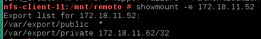

En el cliente vamos a montar y usar cada recurso compartido. Veamos ejemplo con public.
* Crear la carpeta /mnt/remoto/public
* `mount.nfs ip-del-servidor:/var/export/public /mnt/remoto/public` montar el recurso
* `df -hT`, y veremos que los recursos remotos están montados en nuestras carpetas locales.

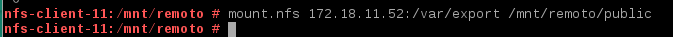

> Para montar los recursos NFS del servidor Windows haremos: 
> * `showmount -e ip-del-servidor`: Para consultar los recursos que exporta el servidor.
> * `mount.nfs ip-del-servidor:/public /mnt/remoto/windows`: Para montar el recurso public del servidor.
>
> Otro ejemplo:
> * `mount.nfs ip-servidor-nfs-windows:/C/export/public /mnt/remoto/windows`
>
> Para comprobar si el recurso está montado usaremos: `df -hT` o `mount`.
>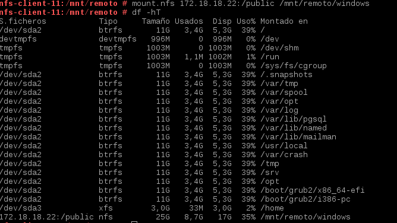

* Ahora "podemos crear carpetas/ficheros dentro del recurso public, 
pero sólo podremos leer lo que aparezca en private". Comprobarlo.

--No es posible comprobarlo ya que no dispongo de permisos debido a un problema en la parte de windows. 

*    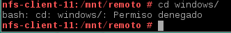

##2.3. Montaje automático
> Acabamos de acceder a recursos remotos, realizando un montaje de forma manual (comandos mount/umount). 
Si reiniciamos el equipo cliente, podremos ver que los montajes realizados de forma manual 
ya no están. Si queremos volver a acceder a los recursos remotos debemos repetir el proceso, 
a no ser que hagamos una configuración permanente o automática.

Para configurar acciones de montaje autoḿaticos cada vez que se inicie el equipo en
OpenSUSE usamos Yast o bien modificamos la configuración del fichero `/etc/fstab`. Comprobarlo.

* Incluir contenido del fichero `/etc/fstab` en la entrega.
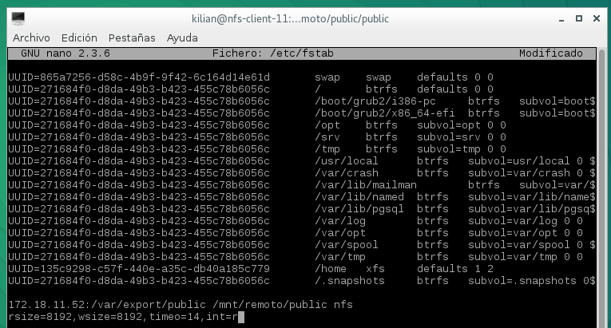

#3. Preguntas

* Nuestro cliente GNU/Linux NFS puede acceder al servidor Windows NFS? Comprobarlo.
* Si, 
* ¿Nuestro cliente Windows NFS podría acceder al servidor GNU/Linux NFS? Comprobarlo.
Si, 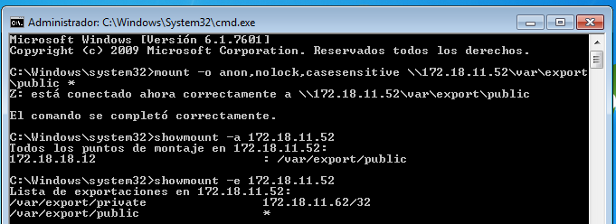

* Fijarse en los valores de usuarios propietario y grupo propietario de los ficheros que se guardan en el servidor, cuando los creamos desde una conexión cliente NFS.
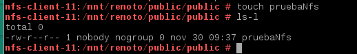

